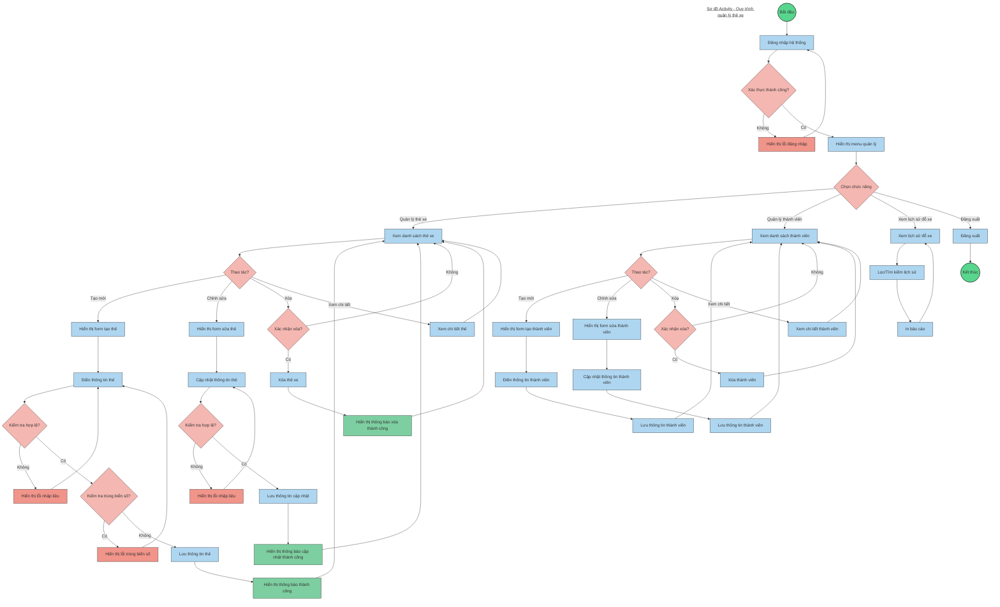

```mermaid
graph TD
    title[<u>Sơ đồ Activity - Quy trình quản lý thẻ xe</u>]
    style title fill:none,stroke:none
    
    %% Start
    Start((Bắt đầu)) --> Login[Đăng nhập hệ thống]
    Login --> CheckAuth{Xác thực thành công?}
    
    CheckAuth -->|Không| ShowAuthError[Hiển thị lỗi đăng nhập]
    ShowAuthError --> Login
    
    CheckAuth -->|Có| AdminMenu[Hiển thị menu quản lý]
    
    %% Main menu selection
    AdminMenu --> ChooseFunction{Chọn chức năng}
    
    %% Card management flow
    ChooseFunction -->|Quản lý thẻ xe| ListCards[Xem danh sách thẻ xe]
    
    ListCards --> CardAction{Thao tác?}
    
    CardAction -->|Tạo mới| CreateCardForm[Hiển thị form tạo thẻ]
    CardAction -->|Chỉnh sửa| EditCardForm[Hiển thị form sửa thẻ]
    CardAction -->|Xóa| ConfirmDeleteCard{Xác nhận xóa?}
    CardAction -->|Xem chi tiết| ViewCardDetails[Xem chi tiết thẻ]
    
    CreateCardForm --> FillCardInfo[Điền thông tin thẻ]
    FillCardInfo --> ValidateCardData{Kiểm tra hợp lệ?}
    
    ValidateCardData -->|Không| ShowCardFormError[Hiển thị lỗi nhập liệu]
    ShowCardFormError --> FillCardInfo
    
    ValidateCardData -->|Có| CheckDuplicatePlate{Kiểm tra trùng biển số?}
    CheckDuplicatePlate -->|Có| ShowDuplicateError[Hiển thị lỗi trùng biển số]
    ShowDuplicateError --> FillCardInfo
    
    CheckDuplicatePlate -->|Không| SaveCardData[Lưu thông tin thẻ]
    SaveCardData --> ShowCardSuccess[Hiển thị thông báo thành công]
    ShowCardSuccess --> ListCards
    
    EditCardForm --> UpdateCardInfo[Cập nhật thông tin thẻ]
    UpdateCardInfo --> ValidateEditedCard{Kiểm tra hợp lệ?}
    
    ValidateEditedCard -->|Không| ShowEditFormError[Hiển thị lỗi nhập liệu]
    ShowEditFormError --> UpdateCardInfo
    
    ValidateEditedCard -->|Có| SaveUpdatedCard[Lưu thông tin cập nhật]
    SaveUpdatedCard --> ShowUpdateSuccess[Hiển thị thông báo cập nhật thành công]
    ShowUpdateSuccess --> ListCards
    
    ConfirmDeleteCard -->|Không| ListCards
    ConfirmDeleteCard -->|Có| DeleteCard[Xóa thẻ xe]
    DeleteCard --> ShowDeleteSuccess[Hiển thị thông báo xóa thành công]
    ShowDeleteSuccess --> ListCards
    
    ViewCardDetails --> ListCards
    
    %% Member management flow
    ChooseFunction -->|Quản lý thành viên| ListMembers[Xem danh sách thành viên]
    
    ListMembers --> MemberAction{Thao tác?}
    
    MemberAction -->|Tạo mới| CreateMemberForm[Hiển thị form tạo thành viên]
    MemberAction -->|Chỉnh sửa| EditMemberForm[Hiển thị form sửa thành viên]
    MemberAction -->|Xóa| ConfirmDeleteMember{Xác nhận xóa?}
    MemberAction -->|Xem chi tiết| ViewMemberDetails[Xem chi tiết thành viên]
    
    CreateMemberForm --> FillMemberInfo[Điền thông tin thành viên]
    EditMemberForm --> UpdateMemberInfo[Cập nhật thông tin thành viên]
    
    FillMemberInfo --> SaveMemberData[Lưu thông tin thành viên]
    UpdateMemberInfo --> SaveUpdatedMember[Lưu thông tin thành viên]
    
    ConfirmDeleteMember -->|Không| ListMembers
    ConfirmDeleteMember -->|Có| DeleteMember[Xóa thành viên]
    
    SaveMemberData --> ListMembers
    SaveUpdatedMember --> ListMembers
    DeleteMember --> ListMembers
    ViewMemberDetails --> ListMembers
    
    %% Parking history
    ChooseFunction -->|Xem lịch sử đỗ xe| ViewParkingHistory[Xem lịch sử đỗ xe]
    ViewParkingHistory --> FilterHistory[Lọc/Tìm kiếm lịch sử]
    FilterHistory --> PrintReport[In báo cáo]
    PrintReport --> ViewParkingHistory
    
    %% Logout flow
    ChooseFunction -->|Đăng xuất| Logout[Đăng xuất]
    Logout --> End((Kết thúc))
    
    %% Style
    classDef start fill:#58D68D,stroke:#333,stroke-width:2px;
    class Start,End start;
    
    classDef process fill:#AED6F1,stroke:#333,stroke-width:1px;
    class Login,AdminMenu,ListCards,CreateCardForm,EditCardForm,ViewCardDetails,FillCardInfo,UpdateCardInfo,SaveCardData,SaveUpdatedCard,DeleteCard,ListMembers,CreateMemberForm,EditMemberForm,ViewMemberDetails,FillMemberInfo,UpdateMemberInfo,SaveMemberData,SaveUpdatedMember,DeleteMember,ViewParkingHistory,FilterHistory,PrintReport,Logout process;
    
    classDef decision fill:#F5B7B1,stroke:#333,stroke-width:1px,rx:5px,ry:5px;
    class CheckAuth,ChooseFunction,CardAction,ValidateCardData,CheckDuplicatePlate,ValidateEditedCard,ConfirmDeleteCard,MemberAction,ConfirmDeleteMember decision;
    
    classDef error fill:#F1948A,stroke:#333,stroke-width:1px;
    class ShowAuthError,ShowCardFormError,ShowDuplicateError,ShowEditFormError error;
    
    classDef success fill:#7DCEA0,stroke:#333,stroke-width:1px;
    class ShowCardSuccess,ShowUpdateSuccess,ShowDeleteSuccess success;
``` 