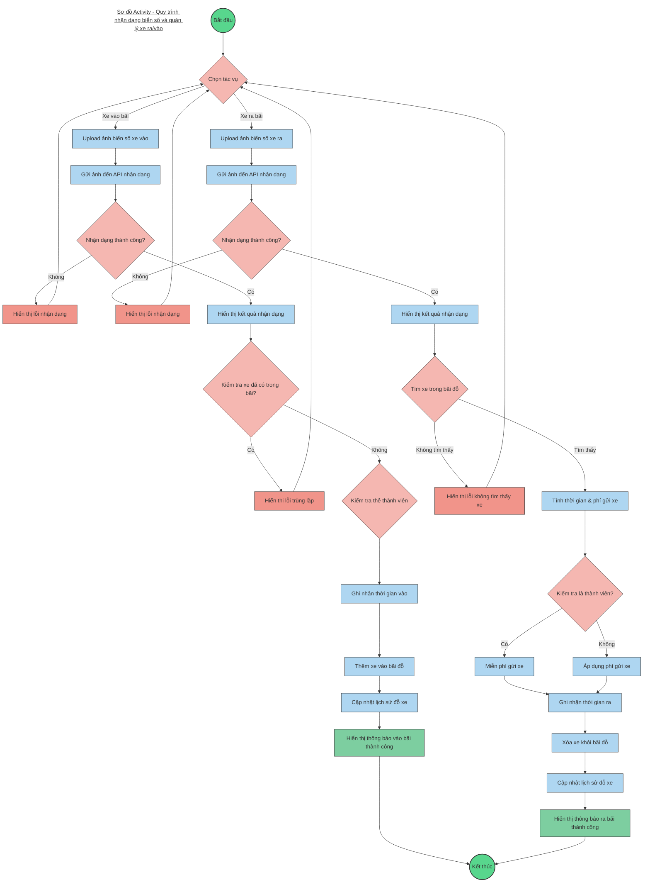

```mermaid
graph TD
    title[<u>Sơ đồ Activity - Quy trình nhận dạng biển số và quản lý xe ra/vào</u>]
    style title fill:none,stroke:none
    
    %% Start
    Start((Bắt đầu)) --> Choose{Chọn tác vụ}
    
    %% Main flow
    Choose -->|Xe vào bãi| UploadImageIn[Upload ảnh biển số xe vào]
    Choose -->|Xe ra bãi| UploadImageOut[Upload ảnh biển số xe ra]
    
    UploadImageIn --> DetectPlateIn[Gửi ảnh đến API nhận dạng]
    UploadImageOut --> DetectPlateOut[Gửi ảnh đến API nhận dạng]
    
    DetectPlateIn --> IsPlateDetectedIn{Nhận dạng thành công?}
    DetectPlateOut --> IsPlateDetectedOut{Nhận dạng thành công?}
    
    IsPlateDetectedIn -->|Không| ShowErrorIn[Hiển thị lỗi nhận dạng]
    IsPlateDetectedOut -->|Không| ShowErrorOut[Hiển thị lỗi nhận dạng]
    
    ShowErrorIn --> Choose
    ShowErrorOut --> Choose
    
    IsPlateDetectedIn -->|Có| DisplayResultIn[Hiển thị kết quả nhận dạng]
    IsPlateDetectedOut -->|Có| DisplayResultOut[Hiển thị kết quả nhận dạng]
    
    DisplayResultIn --> CheckInParkingLot{Kiểm tra xe đã có trong bãi?}
    DisplayResultOut --> FindInParkingLot{Tìm xe trong bãi đỗ}
    
    CheckInParkingLot -->|Có| ShowDuplicateError[Hiển thị lỗi trùng lặp]
    CheckInParkingLot -->|Không| CheckMember{Kiểm tra thẻ thành viên}
    
    FindInParkingLot -->|Không tìm thấy| ShowNotFoundError[Hiển thị lỗi không tìm thấy xe]
    FindInParkingLot -->|Tìm thấy| CalculateFee[Tính thời gian & phí gửi xe]
    
    CheckMember --> RecordEntryTime[Ghi nhận thời gian vào]
    CalculateFee --> CheckIsMember{Kiểm tra là thành viên?}
    
    CheckIsMember -->|Có| FreeParkingFee[Miễn phí gửi xe]
    CheckIsMember -->|Không| ApplyParkingFee[Áp dụng phí gửi xe]
    
    FreeParkingFee --> RecordExitTime[Ghi nhận thời gian ra]
    ApplyParkingFee --> RecordExitTime
    
    RecordEntryTime --> AddVehicleToLot[Thêm xe vào bãi đỗ]
    RecordExitTime --> RemoveVehicleFromLot[Xóa xe khỏi bãi đỗ]
    
    AddVehicleToLot --> UpdateParkingHistory1[Cập nhật lịch sử đỗ xe]
    RemoveVehicleFromLot --> UpdateParkingHistory2[Cập nhật lịch sử đỗ xe]
    
    UpdateParkingHistory1 --> ShowSuccessEntryMsg[Hiển thị thông báo vào bãi thành công]
    UpdateParkingHistory2 --> ShowSuccessExitMsg[Hiển thị thông báo ra bãi thành công]
    
    ShowDuplicateError --> Choose
    ShowNotFoundError --> Choose
    ShowSuccessEntryMsg --> End((Kết thúc))
    ShowSuccessExitMsg --> End
    
    %% Style
    classDef start fill:#58D68D,stroke:#333,stroke-width:2px;
    class Start,End start;
    
    classDef process fill:#AED6F1,stroke:#333,stroke-width:1px;
    class UploadImageIn,UploadImageOut,DetectPlateIn,DetectPlateOut,DisplayResultIn,DisplayResultOut,RecordEntryTime,RecordExitTime,AddVehicleToLot,RemoveVehicleFromLot,UpdateParkingHistory1,UpdateParkingHistory2,CalculateFee,FreeParkingFee,ApplyParkingFee process;
    
    classDef decision fill:#F5B7B1,stroke:#333,stroke-width:1px,rx:5px,ry:5px;
    class Choose,IsPlateDetectedIn,IsPlateDetectedOut,CheckInParkingLot,FindInParkingLot,CheckMember,CheckIsMember decision;
    
    classDef error fill:#F1948A,stroke:#333,stroke-width:1px;
    class ShowErrorIn,ShowErrorOut,ShowDuplicateError,ShowNotFoundError error;
    
    classDef success fill:#7DCEA0,stroke:#333,stroke-width:1px;
    class ShowSuccessEntryMsg,ShowSuccessExitMsg success;
``` 