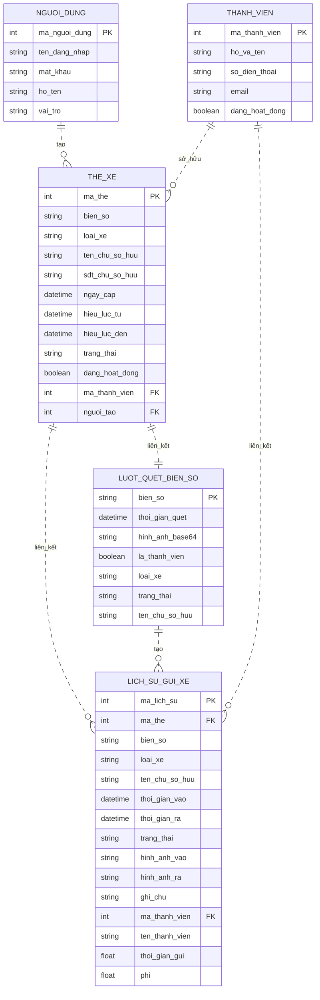

```mermaid
erDiagram
    NGUOI_DUNG {
        int ma_nguoi_dung PK
        string ten_dang_nhap
        string mat_khau
        string ho_ten
        string vai_tro
    }
    
    THANH_VIEN {
        int ma_thanh_vien PK
        string ho_va_ten
        string so_dien_thoai
        string email
        boolean dang_hoat_dong
    }
    
    THE_XE {
        int ma_the PK
        string bien_so
        string loai_xe
        string ten_chu_so_huu
        string sdt_chu_so_huu
        datetime ngay_cap
        datetime hieu_luc_tu
        datetime hieu_luc_den
        string trang_thai
        boolean dang_hoat_dong
        int ma_thanh_vien FK
        int nguoi_tao FK
    }
    
    LUOT_QUET_BIEN_SO {
        string bien_so PK
        datetime thoi_gian_quet
        string hinh_anh_base64
        boolean la_thanh_vien
        string loai_xe
        string trang_thai
        string ten_chu_so_huu
    }
    
    LICH_SU_GUI_XE {
        int ma_lich_su PK
        int ma_the FK
        string bien_so
        string loai_xe
        string ten_chu_so_huu
        datetime thoi_gian_vao
        datetime thoi_gian_ra
        string trang_thai
        string hinh_anh_vao
        string hinh_anh_ra
        string ghi_chu
        int ma_thanh_vien FK
        string ten_thanh_vien
        float thoi_gian_gui
        float phi
    }
    
    NGUOI_DUNG ||..o{ THE_XE : tạo
    THANH_VIEN ||..o{ THE_XE : sở_hữu
    THE_XE ||..o{ LICH_SU_GUI_XE : liên_kết
    THE_XE ||..|| LUOT_QUET_BIEN_SO : liên_kết
    LUOT_QUET_BIEN_SO ||..o{ LICH_SU_GUI_XE : tạo
    THANH_VIEN ||..o{ LICH_SU_GUI_XE : liên_kết
``` 