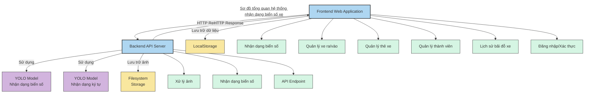

```mermaid
graph TD
    title[<u>Sơ đồ tổng quan hệ thống nhận dạng biển số xe</u>]
    style title fill:none,stroke:none
    
    %% Main components
    FE[Frontend Web Application] -->|HTTP Request| BE[Backend API Server]
    BE -->|HTTP Response| FE
    
    %% AI Models
    BE -->|Sử dụng| LPM[YOLO Model<br/>Nhận dạng biển số]
    BE -->|Sử dụng| OCR[YOLO Model<br/>Nhận dạng ký tự]
    
    %% Storage
    BE -->|Lưu trữ ảnh| FS[Filesystem<br/>Storage]
    FE -->|Lưu trữ dữ liệu| LS[LocalStorage]
    
    %% Frontend modules
    FE --> FE1[Nhận dạng biển số]
    FE --> FE2[Quản lý xe ra/vào]
    FE --> FE3[Quản lý thẻ xe]
    FE --> FE4[Quản lý thành viên]
    FE --> FE5[Lịch sử bãi đỗ xe]
    FE --> FE6[Đăng nhập/Xác thực]
    
    %% Backend modules
    BE --> BE1[Xử lý ảnh]
    BE --> BE2[Nhận dạng biển số]
    BE --> BE3[API Endpoint]
    
    %% Style
    classDef main fill:#AED6F1,stroke:#333,stroke-width:2px;
    class FE,BE main;
    
    classDef module fill:#D5F5E3,stroke:#333,stroke-width:1px;
    class FE1,FE2,FE3,FE4,FE5,FE6,BE1,BE2,BE3 module;
    
    classDef storage fill:#F9E79F,stroke:#333,stroke-width:1px;
    class FS,LS storage;
    
    classDef ai fill:#D2B4DE,stroke:#333,stroke-width:1px;
    class LPM,OCR ai;
``` 