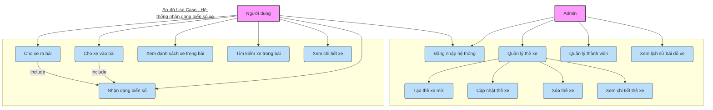

```mermaid
graph TD
    title[<u>Sơ đồ Use Case - Hệ thống nhận dạng biển số xe</u>]
    style title fill:none,stroke:none

    %% Actors
    A1[Admin]
    A2[Người dùng]

    %% Use Cases
    subgraph UC_Admin [ ]
        direction TB
        UC1[Đăng nhập hệ thống]
        UC2[Quản lý thẻ xe]
        UC10[Tạo thẻ xe mới]
        UC11[Cập nhật thẻ xe]
        UC12[Xóa thẻ xe]
        UC13[Xem chi tiết thẻ xe]
        UC3[Quản lý thành viên]
        UC4[Xem lịch sử bãi đỗ xe]
    end

    subgraph UC_User [ ]
        direction TB
        UC5[Nhận dạng biển số]
        UC6[Cho xe vào bãi]
        UC7[Cho xe ra bãi]
        UC8[Xem danh sách xe trong bãi]
        UC9[Tìm kiếm xe trong bãi]
        UC14[Xem chi tiết xe]
    end

    %% Relationships
    A1 --> UC1
    A2 --> UC1

    A1 --> UC2
    A1 --> UC3
    A1 --> UC4

    UC2 --> UC10
    UC2 --> UC11
    UC2 --> UC12
    UC2 --> UC13

    A2 --> UC5
    A2 --> UC6
    A2 --> UC7
    A2 --> UC8
    A2 --> UC9
    A2 --> UC14

    %% Use case includes
    UC6 -->|include| UC5
    UC7 -->|include| UC5

    %% Style
    classDef actor fill:#f9f,stroke:#333,stroke-width:2px;
    class A1,A2 actor;

    classDef usecase fill:#bbdefb,stroke:#333,stroke-width:1px,rx:5px,ry:5px;
    class UC1,UC2,UC3,UC4,UC5,UC6,UC7,UC8,UC9,UC10,UC11,UC12,UC13,UC14 usecase;

``` 
